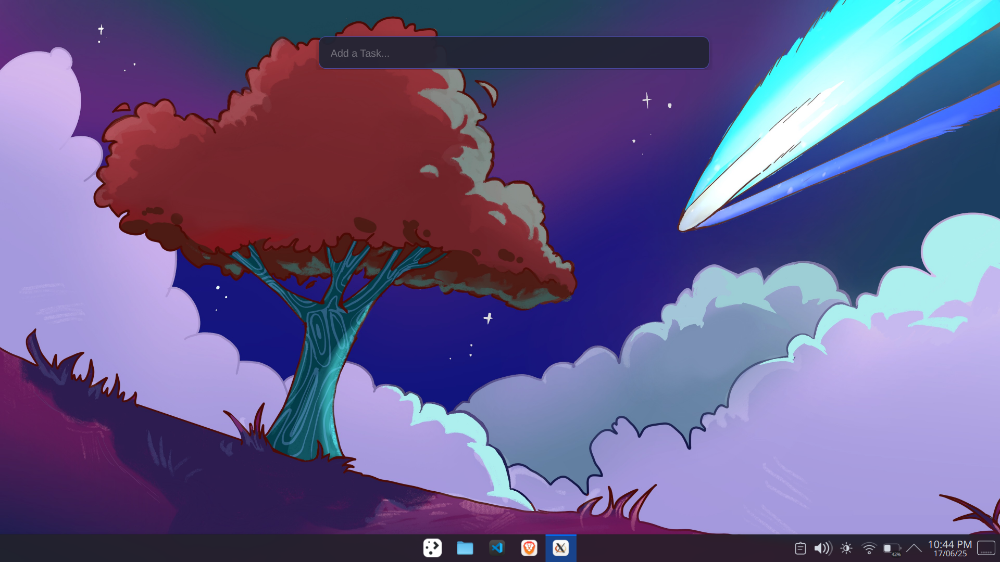

# Quick TODO

A minimal, floating TODO input window that integrates with Todoist. Add tasks quickly without opening the full Todoist interface.



## Features

- 🚀 Minimal floating input window
- ⌨️ Keyboard-centric interaction
- 🎯 Quick task creation in Todoist
- 💫 Smooth animations and visual feedback
- 📌 Always-on-top functionality
- 🔄 Auto-hide when not in focus

## Installation

1. Clone the repository
```bash
git clone https://github.com/Moonlight304/.git
cd electron-quick-todo
```

2. Install dependencies
```bash
npm install
```

3. Create `.env` file and add your Todoist API token:
```bash
cp .env.example .env
# Edit .env and add your Todoist API token
```

4. Start the app
```bash
npm start
```

## Usage

- The app opens a floating input window
- Type your task and press `Enter` to add it to Todoist
- Press `Escape` or click outside to dismiss
- Visual indicators show task status (loading/success/error)

## Tech Stack

- [Electron](https://www.electronjs.org/) - Cross-platform desktop app framework
- [Axios](https://axios-http.com/) - HTTP client for API requests
- [Todoist API](https://developer.todoist.com/rest/v2) - Task management API

## Development

Run the app in development mode with hot reload:
```bash
npm run dev
```

## Contributing

1. Fork the repository
2. Create your feature branch (`git checkout -b feature/amazing-feature`)
3. Commit your changes (`git commit -m 'Add some amazing feature'`)
4. Push to the branch (`git push origin feature/amazing-feature`)
5. Open a Pull Request

## License

This project is licensed under the MIT License - see the [LICENSE](LICENSE) file for details.